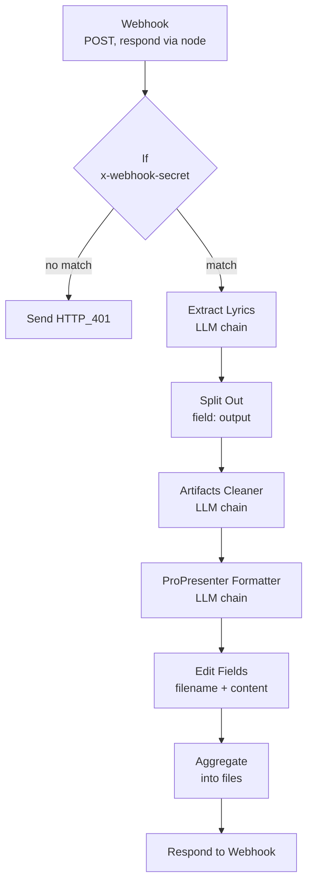
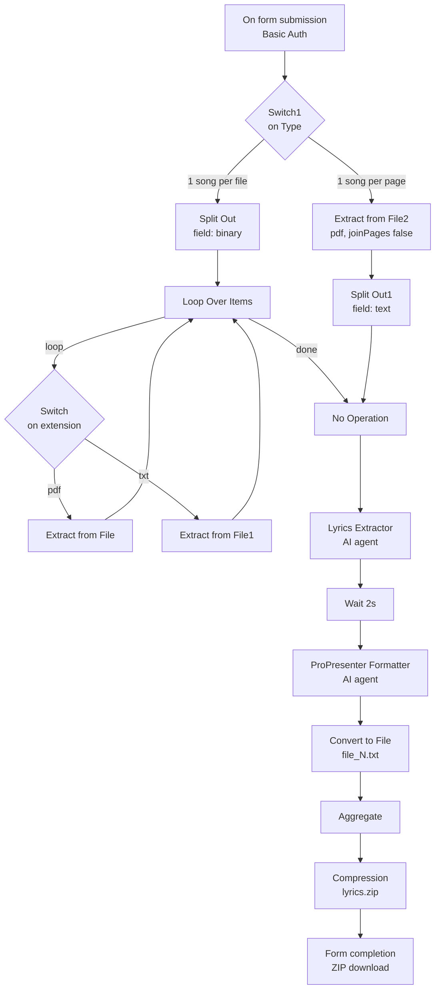

# PDF to ProPresenter Lyrics

n8n workflows that turn messy song sheets — chord charts, OCR'd PDFs, documents with several songs jammed together — into clean lyric text that ProPresenter can import directly, with slide breaks already in the right places.

Built for the media team at **Solace of Christ Church (SCC)**, but there is nothing church-specific in the workflows themselves. Any team running ProPresenter and a self-hosted n8n instance can import these and use them.

Song detection, cleanup, and slide formatting are all done by Google Gemini through n8n's LLM chain nodes.

---

## What it does

**Input** — a typical chord chart, complete with chords over the lyrics, syllable-split words from OCR, and a page footer:

```text
Amazing Grace

Verse 1
G            C        G
Amazing grace how sweet the sound
        Em       D
That saved a wretch like me
G           C          G
I once was lost but now am found
      D        G
Was blind but now I see

Chorus
C           G
Ha - lle - lu - jah

[Repeat Chorus]
Page 3 of 7 — CCLI #22025
```

**Output** — `Amazing Grace.txt`:

```text
[Verse 1]
Amazing grace how sweet the sound
That saved a wretch like me

I once was lost but now am found
Was blind but now I see

[Chorus]
Hallelujah
```

Blank lines are what ProPresenter uses to break slides, so the file imports as a finished presentation rather than one giant wall of text.

---

## The two workflows

| | **v2** (current) | **v1** (legacy) |
|---|---|---|
| File | `[SCC] PDF to ProPresenter Lyrics v2.json` | `[SCC] PDF to ProPresenter Lyrics.json` |
| Trigger | `POST` webhook, secret-header auth | n8n Form, HTTP Basic Auth |
| Input | JSON `{ "text": "..." }` | `.pdf` / `.txt` upload in the browser |
| Output | JSON array of `{ filename, content }` | `lyrics.zip` download |
| Filenames | Named after the detected song title | `file_0.txt`, `file_1.txt`, … |
| Multi-song documents | Yes — splits them automatically | No — one song per file or per page |
| Needs a separate frontend | Yes | No |

**v2** is the one in active use. It is an API: it expects text that has *already* been extracted from the PDF, which the [companion web frontend](#the-frontend) does in the browser. In exchange it gets proper song splitting and real filenames.

**v1** is fully self-contained — upload a file in n8n's own form UI, get a ZIP back. It is still functional and is the faster path if you just want this working without deploying a frontend.

---

## For the media team

1. Open **<https://scc-lyrics-formatter.vercel.app/>** and enter the access code.
2. Upload the song sheet PDF (or paste the lyrics text).
3. Wait for processing, then download the `.txt` file for each song.
4. In ProPresenter: **File → Import**, pick the `.txt` (or just drag it onto the library). Each blank line becomes a new slide.
5. **Read through the slides before service.** The formatting is done by an AI model and it occasionally drops a line, keeps a stray chord, or guesses a section header wrong. It gets you 95% of the way there — the last 5% is still your eyes.

---

## The frontend

- **Live site** — <https://scc-lyrics-formatter.vercel.app/> (access-code gated, so only the SCC team can use it)
- **Source** — <https://github.com/zhrssh/scc-lyrics-formatter>

Its job is small: read the PDF and pull the text out **in the browser**, then `POST` that text to the v2 webhook and offer the returned files as downloads. All the lyric processing happens in n8n.

If you are self-hosting, you don't have to use this frontend — anything that can send an HTTP request works. See the [API reference](#api-reference-v2).

---

## Setup

These workflows are written for **self-hosted n8n**. They will work on n8n Cloud too, but the URLs below assume your own instance.

### Prerequisites

- A running n8n instance (Docker or otherwise)
- A **Google Gemini API key** — <https://aistudio.google.com/app/apikey>

### 1. Import the workflow

In n8n: **Workflows → ⋯ → Import from File**, and pick the `.json` for the version you want.

### 2. Set up the Gemini credential

The exports ship with placeholder credential IDs (`REPLACE_WITH_YOUR_CREDENTIAL_ID`), so every credential has to be re-selected after importing:

1. **Credentials → Add credential → Google Gemini (PaLM) API**, paste your API key, save.
2. Open the workflow and click each **`Google Gemini Chat Model`** node — v2 has one, v1 has two (`Google Gemini Chat Model` and `Google Gemini Chat Model1`) — and re-select your credential from the dropdown.

The model is set to `models/gemini-3.1-flash-lite`. It's cheap and fast enough for this; see [Customization](#customization) to change it.

### 3a. v2 only — webhook auth

1. Open the **`Webhook`** node and click the refresh/regenerate icon on the **Path** field to generate a **new UUID**. The exported path is an all-zeros placeholder (`00000000-0000-0000-0000-000000000000`) and will not work until you replace it. Don't publish the real one — the path is half of what makes the endpoint hard to find.
2. Open the **`If`** node and replace the placeholder `<YOUR SECRET HERE>` with a secret of your own. Incoming requests must send this as the `x-webhook-secret` header; anything else gets a `401`.
3. The `Webhook` node's **Allowed Origins (CORS)** is `*`. If your client is a browser app on a known domain, set it to that origin instead.

> A browser-based client has to ship the webhook secret to the browser, where anyone with devtools can read it. Treat this pair — the secret header plus the site's access code — as a gate that keeps casual traffic out, not as real access control. Keep the workflow's Gemini usage capped accordingly.

### 3b. v1 only — form auth

The **`On form submission`** node uses HTTP Basic Auth. Create a **Basic Auth** credential with the username/password you want the team to use, and select it on that node.

The trigger, `Wait`, and `Form` nodes also carry placeholder webhook IDs in the export. n8n will generate real ones for you — but if your form URL comes out as `/form/00000000-...`, delete and re-add the node so it gets a fresh ID.

### 4. Activate

Toggle the workflow **Active**. Your URLs are then:

- v2 webhook — `https://<your-n8n-host>/webhook/<path>`
- v1 form — the Production URL shown on the `On form submission` node

While testing from the editor, n8n uses `/webhook-test/<path>` instead, and only listens for one request after you press **Execute workflow**.

---

## API reference (v2)

### Request

```http
POST /webhook/<path> HTTP/1.1
Content-Type: application/json
x-webhook-secret: <your secret>
```

```json
{
  "text": "Amazing Grace\n\nVerse 1\nG            C        G\nAmazing grace how sweet the sound\n..."
}
```

The `text` field holds the raw text of one or more songs. Chords, page numbers, credits, and OCR artifacts are expected — cleaning them up is the workflow's job. Multiple songs in one string is fine; they get split apart.

### Response

`200 OK`

```json
{
  "files": [
    {
      "filename": "Amazing Grace.txt",
      "content": "[Verse 1]\nAmazing grace how sweet the sound\nThat saved a wretch like me\n\nI once was lost but now am found\nWas blind but now I see"
    },
    {
      "filename": "How Great Thou Art.txt",
      "content": "[Verse 1]\nO Lord my God\nWhen I in awesome wonder"
    }
  ]
}
```

One entry per song detected. `content` is the finished ProPresenter text — write it to disk as-is.

`401 Unauthorized` — empty body. The `x-webhook-secret` header was missing or wrong.

### curl

```bash
curl -X POST "https://<your-n8n-host>/webhook/<path>" \
  -H "Content-Type: application/json" \
  -H "x-webhook-secret: $WEBHOOK_SECRET" \
  -d '{"text":"Amazing Grace\n\nVerse 1\nG            C        G\nAmazing grace how sweet the sound\nThat saved a wretch like me"}'
```

Expect it to take a while — three sequential LLM calls per song.

---

## How it works

### v2 pipeline



**`Webhook` → `If`** — the `If` node compares the `x-webhook-secret` header against a literal string. The false branch goes to `Send HTTP_401`, which responds with no body and status `401`.

**`Extract Lyrics`** — finds the song boundaries. It splits text where several songs have been concatenated without separators, and merges continuation labels (`Part 2`, `Pt. 2`, `Page 2`, `Continued`) back into a single song under the base title. It does *not* merge songs with different base titles even if the lyrics overlap. Section headers already present in the source are preserved verbatim, and nothing is invented — if the title can't be determined it returns `null`.

**`Split Out`** — the chain returns an array under `output`; this fans it out to one n8n item per song, so the remaining stages run per song.

**`Artifacts Cleaner`** — strips everything that isn't a lyric: chords and slash chords, rhythm marks (`/`, `|`, `x`), tablature, chord-only lines, page numbers, CCLI/credit lines, repeat instructions like `[Repeat Chorus]`, and instrumental markers with no words under them. It also rejoins words OCR split across syllables (`Je - sus` → `Jesus`) and collapses the blank lines that removal leaves behind.

**`ProPresenter Formatter`** — the layout stage. Normalizes section headers to `[Verse 1]` / `[Chorus]` form, splits the lyrics into slides at roughly 6 words per line and a maximum of 2 lines per slide, breaking on natural phrases rather than mid-sentence. It drops consecutive duplicate blocks within a section (a chorus printed three times becomes one), and removes any section header left without lyrics under it. Slides are separated by a single blank line.

**`Edit Fields` → `Aggregate` → `Respond to Webhook`** — sets `filename` to `<title>.txt` and `content` to the formatted lyrics, then collects every song's item into a single `files` array for the response.

Two sub-nodes are shared by all three chains: one **`Google Gemini Chat Model`** and one **`Structured Output Parser`**, whose manual schema is an array of `{ title, lyrics }` with both fields required. That parser is what keeps each stage returning parseable JSON instead of prose.

The full text of all three system prompts is in [`prompts/`](prompts/) if you want to read what each stage is actually told.

**Why three chains instead of one prompt?** Song splitting, artifact removal, and slide layout are unrelated problems, and a single prompt covering all three tended to drop rules under load — it would format nicely but forget to strip a chord, or clean well but merge two songs. Each stage here has a narrow instruction set and a schema to conform to, and each one's output is a valid input for a human to inspect if something goes wrong. The tradeoff is three model calls per song instead of one.

### v1 pipeline



The form asks for one or more `.pdf` / `.txt` files and a **Type**:

- **1 Song Per File** — each uploaded file is one song. Files are split out and looped over one at a time, with a `Switch` on the file extension routing PDFs and text files to the right extractor.
- **1 Song Per Page (Single File Only)** — one PDF where each page is a song. Extracted with `joinPages: false` and split on the resulting `text` array, so each page becomes an item.

Both paths converge on `No Operation, do nothing` and then two AI agents: `Lyrics Extractor` (chord/artifact removal, same job as v2's cleaner) and `ProPresenter Formatter` (slide layout). The **`Wait` 2s** node between them is deliberate — it spaces out calls so a batch of songs doesn't trip Gemini's rate limit.

Each result is written to `file_<index>.txt`, zipped into `lyrics.zip`, and handed back through the form's completion screen as a download. Because v1 has no structured output parser and no title-detection stage, filenames are positional — you get `file_0.txt`, `file_1.txt`, and have to rename them yourself.

---

## Customization

**Slide density** — open the `ProPresenter Formatter` node and edit the system message. The relevant rules are the words-per-line preference (default 6) and the maximum lines per slide (default 2 in v2, 3 in v1). Raising both gives fewer, denser slides.

**Model** — change `modelName` on the `Google Gemini Chat Model` node, or delete it and drop in a different chat-model node (OpenAI, Anthropic, Ollama) and wire it into the same `ai_languageModel` inputs. The chains don't care which model is behind them, though prompt-following quality varies.

**Filenames (v2)** — the `Edit Fields` node builds `filename` from `{{ $json.output[0].title }}.txt`. Change the expression there if you want a prefix, a date, or a different extension.

**Prompts** — all the behaviour described above lives in the system messages of the chain/agent nodes. Every one of them is also checked in as readable Markdown under [`prompts/`](prompts/), which is far easier to diff and edit than escaped JSON strings. Edit them in the n8n UI, then re-export the workflow **and** update the matching file in `prompts/` so the two stay in sync.

---

## Known limitations

- **The output is AI-generated and non-deterministic.** The same input can produce slightly different slide breaks on different runs. Always proofread before a service.
- **Untitled songs become `null.txt`** in v2. If the model can't find a title it returns `null`, and the filename expression interpolates that literally. Rename manually.
- **v1 filenames are positional** — `file_0.txt`, `file_1.txt`, with no relation to the song.
- **v2 doesn't read PDFs.** It takes text only; extraction is the client's job. v1 is the one with PDF handling built in.
- **Long documents can hit limits** — a large songbook may exceed the model's context window or trip rate limits. Split it into a few requests.
- **Chord charts with unusual layouts** (two-column, chords inline mid-word, heavy tablature) come out worse than clean single-column sheets.

---

## License

Apache License 2.0 — see [LICENSE](LICENSE).

Built for and used by **Solace of Christ Church**.
